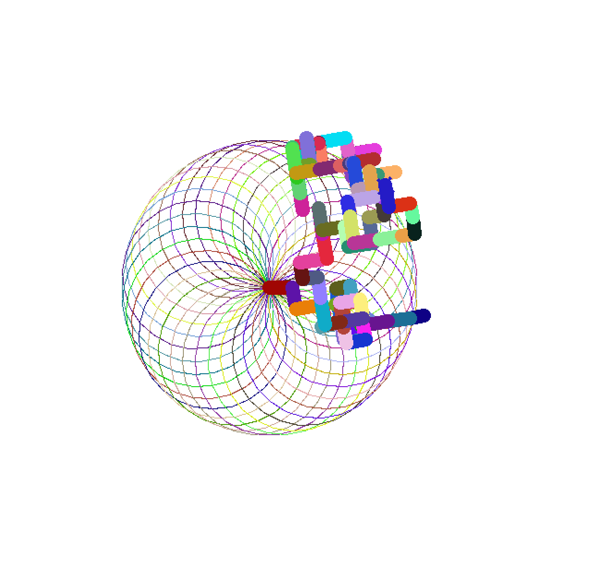

# Games

Welcome to my Game Development Journey repository! This space showcases my evolving skills and methods in game creation, using Python, C++and Unreal Engine as my primary tools. Each of the folder contain individual ReadMe files that goes into detail about how each game works. It is important to understand that most of this projects are built with Linux system in mind, and contains API keys(Respective projects state that in the demo). Please keep this in mind.

Here is a live demo of all games so far:

## Hangman

## Tic-Tac-Toe

## Rock Paper Scissors

## Spirograph
