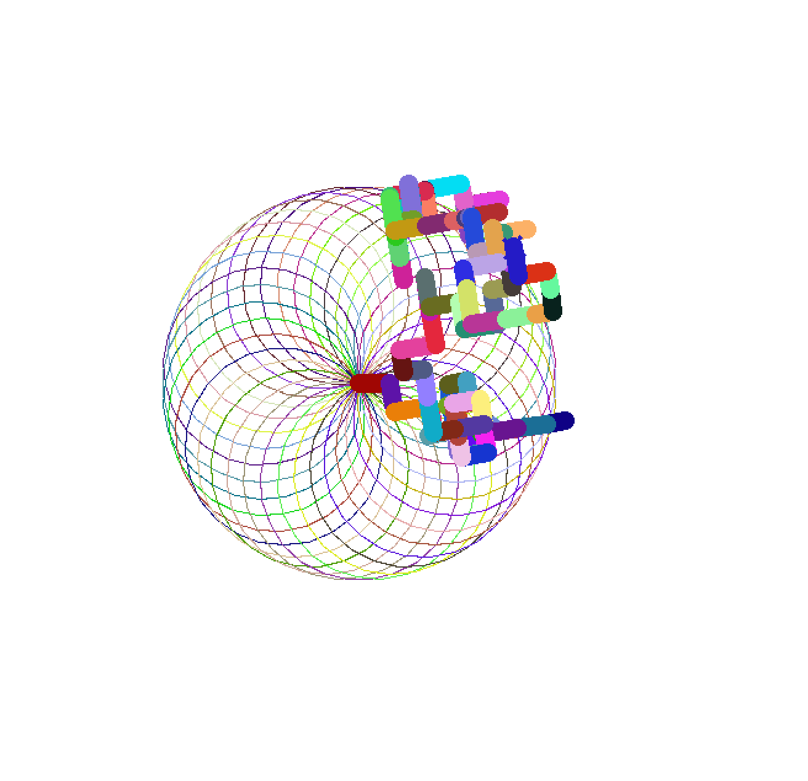

# Mini Art Piece with Python Turtle

## Overview
This Python script uses the graphical features of the turtle module to generate a cool and  dynamic piece of art that uses the mathematical physiology of spirograph, combined with a random walk. The result image is a beautiful mix of geometric patterns with randomized, colorful paths.

### Features

- Spirograph: The script creates uses spirograph pattern by drawing circular paths with a slight offset after each iteration, resulting in a complex design.

- Random Walk: In addition to the spirograph, the script executes a 'random walk', a process that randomly selects direction and length for each step

## How It Works

The script uses the following functions:

- draw_shapes(num_sides): Draws a shape with a specified number of sides, each side with a random length and color. (This is not used in the image)

- rand_walk(): Executes a random walk, choosing from four possible directions and a random pen size, color, and length for each step.

- spirograph(rad): Draws a circular spirograph with a specified radius and a 10-degree offset after each full circle.

## Running the Script

To run this script, you need Python installed on your machine with the turtle module (which is part of the standard library).

- Save the script to a .py file.
- Run the script in your Python environment.
- The turtle graphics window will open displaying the art being created.
- Once the drawing is complete, click on the turtle graphics window to exit and close the program.

## Customization

You can customize the art piece by adjusting:

- The radius of the spirograph.
- The number of iterations for both the spirograph and the random walk.
- The directions and length for the random walk.

Enjoy!!!

